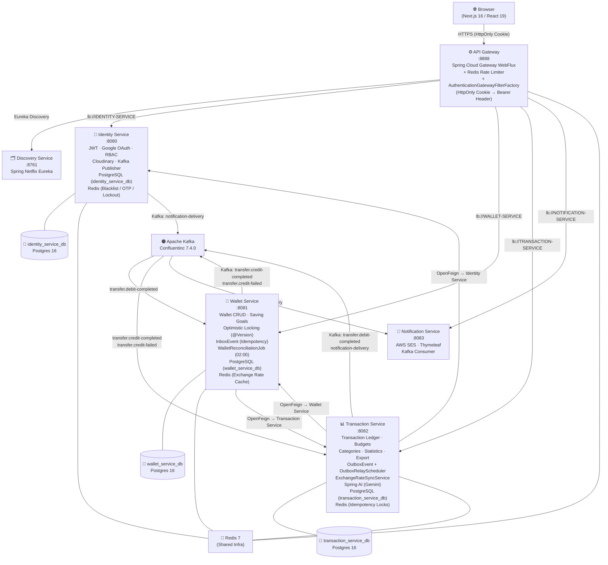

<div align="center">

# 💰 FinTrack Pro

**A production-grade, microservices-based personal finance platform engineered for reliability — featuring an AI receipt scanner (Google Gemini), a Choreography Saga for atomic inter-wallet transfers, and a Transactional Outbox pattern to guarantee zero data loss.**

[](https://openjdk.org/projects/jdk/21/)
[](https://spring.io/projects/spring-boot)
[](https://spring.io/projects/spring-cloud)
[](https://spring.io/projects/spring-ai)
[](https://nextjs.org/)
[](https://react.dev/)
[](https://www.typescriptlang.org/)
[](https://www.postgresql.org/)
[-231F20?logo=apachekafka)](https://kafka.apache.org/)
[](https://redis.io/)
[](https://www.docker.com/)

<p>
  <a href="#-features">Features</a> •
  <a href="#-architecture">Architecture</a> •
  <a href="#-tech-stack">Tech Stack</a> •
  <a href="#-distributed-consistency--security">Security & Consistency</a> •
  <a href="#-getting-started">Getting Started</a>
</p>

</div>

---

## 🌟 Introduction

FinTrack Pro is a full-stack, cloud-native personal finance management platform built on a microservices architecture. It goes far beyond a simple budget tracker: the system manages multi-currency wallets, records and categorizes transactions, sets spending budgets with automated alert emails, and uses **Google Gemini AI** both to extract structured data from receipt photos and to power an interactive financial advisor chatbot with conversation memory.

The backend is architected for operational resilience. A **Choreography Saga** pattern (orchestrated via Kafka topics) guarantees atomicity for inter-wallet transfers across service boundaries, while a **Transactional Outbox** with exponential-backoff retry ensures wallet balance updates are never lost even when downstream services are temporarily unavailable. An automated **Reconciliation Job** (`WalletReconciliationJob`) runs nightly at 02:00 to detect and alert on any balance discrepancies between the wallet store and the transaction ledger, acting as a financial safety net.

Security is handled at the gateway layer: the **API Gateway** (`AuthenticationGatewayFilterFactory`) reads JWT tokens from an **HttpOnly cookie** to prevent XSS exposure, calls the identity service for token introspection, and propagates a validated `Authorization: Bearer` header to all downstream services. Brute-force login attacks are blocked by a Redis-backed sliding-window counter in `AuthenticationService`.

---

## 📌 Features

### 🔐 Identity & Access Management
- **Username/Password Registration & Login** with BCrypt password hashing.
- **Google OAuth2 Single Sign-On** (via `google-api-client 2.7.2`) — auto-provisions new accounts on first login.
- **Password Recovery via OTP** — a 6-digit OTP is generated, stored hashed in Redis with a 5-minute TTL, and delivered via email (Kafka → Notification Service → AWS SES).
- **OTP Rate Limiting** — a Redis `SETNX`-based gate prevents spam (one OTP per 60 seconds per email).
- **JWT Token Rotation** — on every refresh, the old token is immediately blacklisted in Redis; the new token ID is persisted in the `users.current_jwt_id` column.
- **Role-Based Access Control (RBAC)** — `User`, `Role`, and `Permission` entities with a `ManyToMany` join table; scopes are embedded in the JWT.
- **Single-Session Enforcement** — logging in from a new device automatically invalidates the existing session.
- **User Profile Management** — full name, date of birth, phone number, city, base currency, avatar upload (Cloudinary).
- **Soft Delete** — users are never physically removed; a `deleted` flag prevents them from authenticating.

### 💼 Wallet Management
- **Create, Read, Update, Delete Wallets** (`WalletController`).
- **Wallet Types: `BASIC` and `SAVING`** — saving wallets track a `targetAmount` and `deadline`.
- **Manual Balance Adjustment** — records a `"Điều chỉnh số dư"` adjustment transaction automatically.
- **Multi-currency Support** — wallets store a `currency` field; the system tracks exchange rates for VND, USD, and EUR.
- **Wallet Audit Log** — every balance change produces an entry in the `wallet_audit_logs` table.
- **Idempotent Balance Updates** — all balance change operations accept an `idempotencyKey` to prevent duplicate credits/debits.
- **Keyword & Currency Filtering** — `GET /wallets?keyword=&currency=`.

### 📊 Transaction Ledger
- **Create, Read, Update, Delete Transactions** (`TransactionCommandService`, `TransactionQueryService`).
- **Transaction Types: `INCOME` and `EXPENSE`** with category assignment.
- **Advanced Filtering** — by wallet, type, date range, category, and keyword (`TransactionController`).
- **Pagination** — server-side pagination with `PageResponse<TransactionResponse>`.
- **Soft Delete** — deleted transactions are flagged, not erased; balance reversion is queued via the Outbox.
- **Redis Idempotency Lock** — a per-user distributed lock (`lock:create_transaction:{userId}`) prevents duplicate transaction creation from concurrent requests.

### 🔁 Inter-Wallet Transfers (Choreography Saga)
- **Atomic Cross-Wallet Transfer** — `POST /transactions/transfer` initiates a full saga lifecycle.
- Two compensating transactions (`EXPENSE` on the source wallet, `INCOME` on the destination) are written immediately in `PENDING` status with a shared `sagaId`.
- A Kafka event (`transfer.debit-completed`) triggers the credit step in Wallet Service (`TransferCreditListener`).
- On success, `TransferSagaListener` (in Transaction Service) marks both transactions `COMPLETED` via the `transfer.credit-completed` topic.
- On failure, a full compensation is executed: money is returned to the source wallet and a `"Hoàn tiền giao dịch"` income transaction is created (`transfer.credit-failed` topic).
- **Inbox Pattern** (`InboxEvent`) on the wallet side guarantees exactly-once credit processing.

### 📈 Statistics & Reporting
- **Total Portfolio Balance** — aggregates across all wallets (`/statistics/total-balance`).
- **Balance Trend** — a monthly rolling history for sparkline charts (`/statistics/trend`).
- **Expense Structure** — spending breakdown by category for a given month/year (`/statistics/structure`).
- **Highest Expenses** — ranked list of top spending transactions for a period.
- **Monthly Summary** — total income vs. total expenses for a month (`/statistics/monthly`).
- **Excel Export** — `TransactionExportService` uses **Apache POI 5.5.1** to generate downloadable `.xlsx` reports with optional filters.

### 🤖 AI-Powered Features (Spring AI + Google Gemini)
- **AI Receipt Scanner** (`AiAssistantService`, `POST /ai/scan-receipt`) — accepts a receipt image or raw text and uses **Google Gemini** (multimodal) to extract `amount`, `date`, `note`, `type`, `categoryId`, and `currency` as a structured JSON object. Relative date expressions ("yesterday", "last week") are resolved against the current date.
- **AI Financial Advisor Chatbot** (`AiAdvisorService`, `POST /ai/chat`) — a conversational financial advisor with **persistent chat memory** (`SimpleChatMemory`/`MessageChatMemoryAdvisor`) per user ID and **function calling tools** (`AiToolConfig`) to autonomously query the user's live budgets and savings goals before responding.

### 💸 Budgeting & Alerts
- **Create, Update, Delete Budgets** per category, month, year, and optionally per wallet (`BudgetController`, `BudgetService`).
- **Automatic Budget Alert Engine** (`BudgetAlertEngine`) — triggered synchronously every time a transaction is created or updated; fires an email notification when spending in a category reaches **80%** of the budget limit.
- **Budget Progress Tracking** — calculates spent vs. allocated amounts (`BudgetService`).

### 🗂️ Category Management
- **System Categories** (seeded, `userId = null`) and **User-Defined Categories** (`CategoryController`).
- Categories are scoped by type (`INCOME` / `EXPENSE`) and filtered accordingly.
- Soft-delete with referential integrity checks before removal.

### 🌐 Currency Conversion
- **Daily Exchange Rate Sync** (`ExchangeRateSyncService`) — a scheduled job (`@Scheduled(cron = "0 0 0 * * ?")`) fetches live rates from an external API for VND, USD, and EUR at midnight, stores them in PostgreSQL, and caches them in Redis with a 25-hour TTL.
- **Currency Converter** (`CurrencyConverterService`) — reads from Redis cache (falling back to DB) to convert amounts on demand.

### 🔔 Notifications
- **Transactional Email** delivered via **AWS SES** using **Thymeleaf** HTML templates.
- All notification dispatch is async: publishers fire Kafka events onto the `notification-delivery` topic; `NotificationService` is the sole consumer.
- Notification triggers: new transaction, budget threshold breached, password reset OTP, transfer result.

---

## 🏗️ Architecture

### Microservices Topology



### Kafka Topic Map

| Topic Name | Publisher | Consumer | Description |
|---|---|---|---|
| `notification-delivery` | `identity-service` (`AuthenticationService`) | `notification-service` | OTP emails, password reset notifications |
| `notification-delivery` | `transaction-service` (`TransactionNotificationWorker`, `BudgetAlertEngine`) | `notification-service` | Transaction receipts, budget threshold alerts |
| `transfer.debit-completed` | `transaction-service` (`OutboxRelayScheduler`) | `wallet-service` (`TransferCreditListener`) | Saga Step 2 — notify wallet service to credit the destination wallet |
| `transfer.credit-completed` | `wallet-service` (`TransferCreditListener`) | `transaction-service` (`TransferSagaListener`) | Saga Step 3 (success) — mark both transactions as `COMPLETED` |
| `transfer.credit-failed` | `wallet-service` (`TransferCreditListener`) | `transaction-service` (`TransferSagaListener`) | Saga Step 3 (failure) — trigger compensation; refund source wallet |

---

## 🔐 Distributed Consistency & Security

### 1. Gateway Stateful Auth — `AuthenticationGatewayFilterFactory`

The API Gateway (`api-gateway`) implements a **stateful** authentication strategy using **HttpOnly cookies** to shield the JWT from JavaScript-based XSS attacks. The `AuthenticationGatewayFilterFactory` filter, applied to all private routes in `application.yml`, follows a dual-extraction strategy:

1. It first checks the `Authorization: Bearer ...` header (for Swagger / Postman / API clients).
2. If absent, it reads the `access_token` **HttpOnly cookie** (for browser-based frontend calls with `withCredentials: true`).

If a token is found, the filter calls `IdentityService.introspect()` (which delegates to `POST /auth/introspect` on the Identity Service). Upon a valid response, the filter **mutates the downstream request** by injecting an `Authorization: Bearer <token>` header, so every downstream microservice receives a standard OAuth2 Bearer token without any cookie-parsing logic of their own.

Public endpoints (`/identity/auth/token`, `/identity/auth/google`, `/identity/auth/refresh`, `/identity/auth/logout`, `/identity/auth/forgot-password`, `/identity/auth/reset-password`, and `POST /identity/users`) are whitelisted via `AntPathMatcher` and bypass the filter entirely.

A **Redis Token Blacklist** (`jwt_blacklist:{jwtId}`) ensures that logged-out or rotated tokens are immediately rejected, even before their natural expiry.

### 2. Brute-Force Account Lockout — `AuthenticationService`

The `authenticate()` method in `AuthenticationService` implements a **Redis-backed sliding-window lockout**:

```
login_attempts:{username}  → increment on each bad password; expire after 15 minutes
account_locked:{username}  → set to "LOCKED" with 15-minute TTL after 5 consecutive failures
```

On every login attempt, the service first checks for the `account_locked:*` key. If present, it immediately throws `ErrorCode.ACCOUNT_LOCKED` without even looking up the user. A successful login immediately deletes the `login_attempts:*` counter.

The **Gateway-level Rate Limiter** (`RateLimiterConfig`, `application.yml`) adds a second layer: requests are bucketed per user token (or IP for anonymous traffic) using **Redis Token Bucket** algorithm — `replenishRate: 10 req/s`, `burstCapacity: 20 req/s`.

### 3. Choreography Saga & Transactional Outbox — `TransactionCommandService` + `OutboxRelayScheduler`

The inter-wallet transfer flow is the most complex distributed transaction in the system. It is implemented as a **Choreography Saga** driven by Kafka, with the **Transactional Outbox Pattern** guaranteeing at-least-once delivery:

**Step 1 — Initiate (`TransactionCommandService.transfer()`):**
- Within a single `@Transactional` boundary, two `Transaction` records (`EXPENSE` on source, `INCOME` on destination) are saved with `TransferStatus.PENDING` and a shared `sagaId` (UUID).
- Two `OutboxEvent` rows are written atomically in the same DB transaction:
  - `WALLET_UPDATE` type → debit the source wallet balance.
  - `KAFKA_PUBLISH` type → publish `transfer.debit-completed` event to Kafka.

**Step 2 — Relay (`OutboxRelayScheduler`, every 5 seconds):**
- Polls for `PENDING` outbox events whose `nextRetryAt ≤ now`.
- Dispatches `WALLET_UPDATE` events via OpenFeign (`WalletClient`) and `KAFKA_PUBLISH` events via `KafkaTemplate`.
- On failure: increments `retryCount`, applies **exponential backoff** (`delay = 10 × 3^(retryCount-1)` seconds), and reschedules. After 5 failures, the event is promoted to `FAILED` (dead letter) for manual DBA intervention.

**Step 3a — Credit (`TransferCreditListener`, Wallet Service):**
- Consumes `transfer.debit-completed`.
- Checks the **Inbox Table** (`InboxEvent`) for idempotency — duplicate events are silently ignored.
- Applies the credit to the destination wallet.
- Publishes `transfer.credit-completed` (success) or `transfer.credit-failed` (failure) back to Kafka.

**Step 3b — Finalize / Compensate (`TransferSagaListener`, Transaction Service):**
- Consumes `transfer.credit-completed` → sets both transactions to `COMPLETED`.
- Consumes `transfer.credit-failed` → calls `WalletClient` to refund the source wallet, creates a new `INCOME` refund transaction with `TransferStatus.COMPENSATED`, and soft-deletes the failed income transaction.
- Both listeners use a Redis key (`saga:terminal:{sagaId}`) to de-duplicate terminal events.

### 4. Automated Balance Reconciliation — `WalletReconciliationJob`

A Spring `@Scheduled` job runs every day at **02:00 AM** (`cron = "0 0 2 * * ?"`). It pages through all active wallets (100 per page) and, for each batch, calls `TransactionClient.getNetBalancesForWallets()` (an internal OpenFeign call to Transaction Service) to recompute the expected balance from the ledger. Any mismatch between `wallet.balance` (in wallet DB) and the computed net balance (from transaction DB) is logged as a `[RECONCILIATION ALERT]` error, giving the operations team visibility into consistency drift without automated correction (human-reviewed).

### 5. Optimistic Locking — `Wallet` Entity

The `Wallet` entity declares:

```java
@Version
private Long version;
```

JPA's optimistic locking mechanism uses this field to detect concurrent modifications. If two threads attempt to update the same wallet row simultaneously (e.g., two simultaneous transactions), the second `SAVE` will throw an `OptimisticLockException`, preventing a lost-update anomaly without the overhead of pessimistic database locks. This is particularly important given that the `OutboxRelayScheduler` and direct OpenFeign calls can both touch the same wallet concurrently during high-throughput periods.

---

## 🧱 Tech Stack

### Backend

| Component | Technology | Version |
|---|---|---|
| Language | Java | 21 |
| Application Framework | Spring Boot | 4.0.1 |
| Service Mesh | Spring Cloud | 2025.1.0 |
| API Gateway | Spring Cloud Gateway (WebFlux) | 2025.1.0 |
| Service Discovery | Spring Netflix Eureka | 2025.1.0 |
| Service-to-Service | Spring Cloud OpenFeign | 2025.1.0 |
| Load Balancing | Spring Cloud LoadBalancer | 2025.1.0 |
| Security | Spring Security + OAuth2 Resource Server | 4.0.1 |
| JWT Library | Nimbus JOSE + JWT | 10.5 |
| Google OAuth2 | google-api-client | 2.7.2 |
| Persistence | Spring Data JPA + Hibernate | 4.0.1 |
| Database Migration | Flyway | 4.0.1 (managed) |
| Database Driver | PostgreSQL JDBC | 16 |
| Message Broker | Spring Kafka | 4.0.1 (managed) |
| Cache / Session | Spring Data Redis | 4.0.1 (managed) |
| AI Integration | Spring AI (Google Gemini GenAI) | 2.0.0-M2 |
| Resilience | Spring Cloud Circuit Breaker / Resilience4j | 2025.1.0 |
| Retry | Spring Retry + Spring AOP | 4.0.1 |
| File Generation | Apache POI (OOXML) | 5.5.1 |
| API Docs | SpringDoc OpenAPI (Swagger UI) | 2.8.13 |
| Object Mapping | MapStruct | 1.5.5.Final |
| Email | AWS SES SDK | 2.44.10 |
| Email Templating | Spring Thymeleaf | 4.0.1 |
| Image Upload | Cloudinary HTTP44 | 1.39.0 |
| Boilerplate | Lombok | 4.0.1 (managed) |

### Frontend

| Component | Technology | Version |
|---|---|---|
| Framework | Next.js (App Router) | 16.1.2 |
| UI Runtime | React / React DOM | 19.2.3 |
| Language | TypeScript | ^5 |
| Styling | TailwindCSS + tw-animate-css | ^4 |
| UI Primitives | Radix UI (Alert, Avatar, Dialog, Dropdown, Popover, Progress, Select, Switch, Tabs, etc.) | ^1–^2 |
| Charts | Recharts | ^3.7.0 |
| Data Fetching | TanStack React Query | ^5.90.17 |
| Tables | TanStack React Table | ^8.21.3 |
| Forms | React Hook Form + Hookform Resolvers | ^7.71.1 |
| Form Validation | Zod | ^4.3.5 |
| HTTP Client | Axios | ^1.13.2 |
| Date Handling | date-fns | ^4.1.0 |
| Google Sign-In | @react-oauth/google | ^0.13.4 |
| Notifications / Toast | Sonner | ^2.0.7 |
| Number Formatting | react-number-format | ^5.4.5 |
| Date Picker | react-day-picker | ^9.13.0 |
| Theme | next-themes | ^0.4.6 |
| Icons | lucide-react | ^0.562.0 |
| Confetti | canvas-confetti | ^1.9.4 |

### Infrastructure

| Component | Technology | Version |
|---|---|---|
| Container Runtime | Docker + Docker Compose | 3.8 |
| Message Broker | Confluent Platform Kafka | 7.4.0 |
| ZooKeeper | Confluent ZooKeeper | 7.4.0 |
| Database | PostgreSQL | 16-alpine |
| Cache / Pub-Sub | Redis | 7-alpine |
| DB Admin Tool | pgAdmin 4 | latest |

---

## 🗂️ Project Structure

```
FinTrack-Pro/
├── .github/                          # GitHub Actions workflows (CI/CD)
├── docker/
│   ├── docker-compose.yml            # Full-stack orchestration (9 containers)
│   ├── .env                          # Docker Compose secrets (gitignored)
│   └── .env.example
│
├── backend/
│   ├── discovery-service/            # :8761 — Eureka Server
│   │   └── src/...
│   │
│   ├── api-gateway/                  # :8888 — Spring Cloud Gateway (WebFlux)
│   │   └── src/main/java/com/fintrack/api_gateway/
│   │       ├── configuration/
│   │       │   ├── AuthenticationGatewayFilterFactory.java  ← HttpOnly Cookie auth
│   │       │   ├── RateLimiterConfig.java                   ← Redis rate limiter
│   │       │   ├── CorsConfig.java
│   │       │   └── WebClientConfiguration.java
│   │       ├── service/IdentityService.java                 ← Introspect caller
│   │       └── dto/
│   │
│   ├── identity-service/             # :8080 — Auth, Users, RBAC
│   │   └── src/main/java/com/fintrack/identity_service/
│   │       ├── controller/
│   │       │   ├── AuthenticationController.java            ← /auth/* endpoints
│   │       │   ├── UserController.java
│   │       │   ├── RoleController.java
│   │       │   └── PermissionController.java
│   │       ├── service/
│   │       │   ├── AuthenticationService.java               ← JWT, Redis lockout, Google OAuth
│   │       │   ├── UserService.java
│   │       │   ├── CloudinaryService.java
│   │       │   ├── RoleService.java
│   │       │   └── PermissionService.java
│   │       ├── entity/ (User, Role, Permission)
│   │       ├── utils/CookieUtils.java                       ← HttpOnly cookie helper
│   │       └── configuration/
│   │
│   ├── wallet-service/               # :8081 — Wallet CRUD, Saving Goals
│   │   └── src/main/java/com/fintrack/wallet_service/
│   │       ├── controller/
│   │       │   ├── WalletController.java
│   │       │   └── InternalWalletController.java
│   │       ├── service/WalletService.java                   ← Idempotent balance updates
│   │       ├── entity/
│   │       │   ├── Wallet.java                              ← @Version (Optimistic Locking)
│   │       │   ├── InboxEvent.java                          ← Idempotency store
│   │       │   └── WalletAuditLog.java
│   │       ├── event/consumer/
│   │       │   ├── TransferCreditListener.java              ← Saga Step 3: credit wallet
│   │       │   └── UserDeletedListener.java
│   │       └── job/WalletReconciliationJob.java             ← Nightly 02:00 reconciliation
│   │
│   ├── transaction-service/          # :8082 — Ledger, Budgets, AI, Stats, Export
│   │   └── src/main/java/com/fintrack/transaction_service/
│   │       ├── controller/
│   │       │   ├── TransactionController.java               ← CRUD, transfer, stats, export
│   │       │   ├── BudgetController.java
│   │       │   ├── CategoryController.java
│   │       │   ├── AiAssistantController.java               ← /ai/scan-receipt, /ai/chat
│   │       │   └── TransactionInternalController.java
│   │       ├── service/
│   │       │   ├── transaction/
│   │       │   │   ├── TransactionCommandService.java       ← Create/Update/Delete/Transfer
│   │       │   │   ├── TransactionQueryService.java
│   │       │   │   ├── TransactionStatisticsService.java
│   │       │   │   ├── TransactionExportService.java        ← Apache POI Excel
│   │       │   │   ├── TransactionNotificationWorker.java
│   │       │   │   ├── OutboxService.java                   ← Outbox writer
│   │       │   │   └── OutboxRelayScheduler.java            ← Outbox poller (every 5s)
│   │       │   ├── budget/
│   │       │   │   ├── BudgetService.java
│   │       │   │   └── BudgetAlertEngine.java               ← 80% threshold alerts
│   │       │   ├── ai/
│   │       │   │   ├── AiAssistantService.java              ← Gemini receipt OCR
│   │       │   │   └── AiAdvisorService.java                ← Gemini advisor + function calling
│   │       │   ├── currency/
│   │       │   │   ├── ExchangeRateSyncService.java         ← Daily cron + startup sync
│   │       │   │   └── CurrencyConverterService.java
│   │       │   └── category/CategoryService.java
│   │       ├── entity/
│   │       │   ├── Transaction.java
│   │       │   ├── OutboxEvent.java                         ← Transactional Outbox
│   │       │   ├── Budget.java
│   │       │   ├── Category.java
│   │       │   └── ExchangeRate.java
│   │       └── event/consumer/
│   │           ├── TransferSagaListener.java                ← Saga Step 4: finalize/compensate
│   │           └── UserDeletedListener.java
│   │
│   └── notification-service/         # :8083 — Email delivery (AWS SES + Thymeleaf)
│       └── src/main/java/com/fintrack/notification_service/
│           └── service/EmailService.java
│
└── frontend/                         # Next.js 16 / React 19 App Router SPA
    └── src/
        ├── app/
        │   ├── (auth)/               # login, register, forgot-password pages
        │   └── (dashboard)/
        │       ├── page.tsx          # Main dashboard
        │       ├── wallets/          # Wallet management page
        │       ├── transactions/     # Transaction ledger page
        │       ├── budgets/          # Budget management page
        │       ├── categories/       # Category management page
        │       ├── profile/          # User profile page
        │       └── settings/         # App settings page
        ├── services/                 # Axios-based API clients
        │   ├── auth.service.ts
        │   ├── wallet.service.ts
        │   ├── transaction.service.ts
        │   ├── budget.service.ts
        │   ├── category.service.ts
        │   ├── statistics.service.ts
        │   └── user.service.ts
        ├── components/               # Reusable UI components (Radix UI + shadcn/ui)
        ├── hooks/                    # Custom React hooks
        ├── providers/                # React Context providers
        ├── types/                    # TypeScript type definitions
        ├── lib/                      # Utility functions
        └── middleware.ts             # Next.js edge middleware (route protection)
```

---

## 🚀 Getting Started

### Prerequisites

- [Docker Desktop](https://www.docker.com/products/docker-desktop/) (with Docker Compose V2)
- [Node.js](https://nodejs.org/) ≥ 20 and npm (for local frontend development)
- A Google Cloud project with an **OAuth2 Client ID** (for Google login) and a **Gemini API key** (for AI features)
- An **AWS account** with SES configured (for email notifications)
- A **Cloudinary** account (for avatar uploads)

### Step 1 — Configure Environment Variables

Each service has an `.env` file. Start by copying the examples:

```bash
# Docker Compose secrets
cp docker/.env.example docker/.env

# Per-service backend secrets
cp backend/identity-service/.env.example    backend/identity-service/.env  # (if present)
cp backend/wallet-service/.env.example      backend/wallet-service/.env
cp backend/transaction-service/.env.example backend/transaction-service/.env
cp backend/notification-service/.env.example backend/notification-service/.env
cp backend/api-gateway/.env.example         backend/api-gateway/.env

# Frontend
cp frontend/.env.example frontend/.env
```

Then open each `.env` file and fill in the required values:

| Service | Key Variables |
|---|---|
| `docker/.env` | `IDENTITY_DB_USER`, `IDENTITY_DB_PASSWORD`, `WALLET_DB_USER`, `WALLET_DB_PASSWORD`, `TRANSACTION_DB_USER`, `TRANSACTION_DB_PASSWORD`, `PGADMIN_EMAIL`, `PGADMIN_PASSWORD` |
| `api-gateway/.env` | `INTERNAL_SECRET`, `ALLOWED_ORIGINS` |
| `identity-service/.env` | `JWT_SIGNER_KEY`, `GOOGLE_CLIENT_ID`, `CLOUDINARY_CLOUD_NAME`, `CLOUDINARY_API_KEY`, `CLOUDINARY_API_SECRET` |
| `transaction-service/.env` | `SPRING_AI_GOOGLE_GEMINI_API_KEY`, `EXCHANGE_RATE_API_KEY` |
| `notification-service/.env` | `AWS_ACCESS_KEY_ID`, `AWS_SECRET_ACCESS_KEY`, `AWS_REGION`, `SES_FROM_EMAIL` |
| `frontend/.env` | `NEXT_PUBLIC_API_URL=http://localhost:8888`, `NEXT_PUBLIC_GOOGLE_CLIENT_ID` |

### Step 2 — Launch All Backend Services

```bash
cd docker
docker compose up --build -d
```

This starts **9 containers** in dependency order:

| Container | Port | Description |
|---|---|---|
| `fintrack-discovery-service` | `8761` | Eureka dashboard |
| `fintrack-identity-db` | `5432` | PostgreSQL for Identity |
| `fintrack-wallet-db` | `5433` | PostgreSQL for Wallet |
| `fintrack-transaction-db` | `5434` | PostgreSQL for Transaction |
| `fintrack-redis` | `6379` | Redis |
| `fintrack-zookeeper` | `2181` | ZooKeeper |
| `fintrack-kafka` | `29092` | Kafka Broker |
| `fintrack-pgadmin` | `5050` | pgAdmin 4 UI |
| `fintrack-identity-service` | `8080` | Identity Service |
| `fintrack-wallet-service` | `8081` | Wallet Service |
| `fintrack-transaction-service` | `8082` | Transaction Service |
| `fintrack-notification-service` | `8083` | Notification Service |
| `fintrack-api-gateway` | `8888` | API Gateway |

Wait for all services to pass their health checks:

```bash
docker compose ps       # All should show "healthy" or "running"
docker compose logs -f  # Tail logs for troubleshooting
```

> **Flyway** automatically runs database migrations on startup for Identity, Wallet, and Transaction services. No manual SQL setup is required.

### Step 3 — Launch the Frontend

```bash
cd frontend
npm install
npm run dev
```

The frontend is now available at **http://localhost:3000**.

### Step 4 — Explore the APIs

Swagger UI is available at the service level (bypasses the gateway for local development):

| Service | Swagger UI |
|---|---|
| Identity Service | http://localhost:8080/swagger-ui.html |
| Wallet Service | http://localhost:8081/swagger-ui.html |
| Transaction Service | http://localhost:8082/swagger-ui.html |

The API Gateway is the single entrypoint for all production-style requests: **http://localhost:8888**.

### Stopping the Stack

```bash
cd docker
docker compose down          # Stop and remove containers (data volumes persist)
docker compose down -v       # Stop and remove containers + volumes (full reset)
```

---

## 🛡️ Security Considerations

> ⚠️ **Never commit `.env` files or secrets to version control.** All `.env` files are listed in `.gitignore`.

- The `INTERNAL_SECRET` header (`X-Internal-Secret`) prevents direct bypass of the API Gateway for internal service-to-service calls.
- JWTs are signed with HMAC-SHA512 (`JWSAlgorithm.HS512`) using a strong random `jwt.signerKey`.
- All tokens are delivered and read exclusively via **HttpOnly, Secure, SameSite=Strict cookies** in the browser flow.
- Redis blacklisting invalidates tokens within milliseconds of logout or rotation.
- Passwords are hashed with **BCrypt** before storage.

---

<div align="center">
  <sub>Built with ☕ Java, ⚛️ React, and a lot of distributed systems thinking.</sub>
</div>
